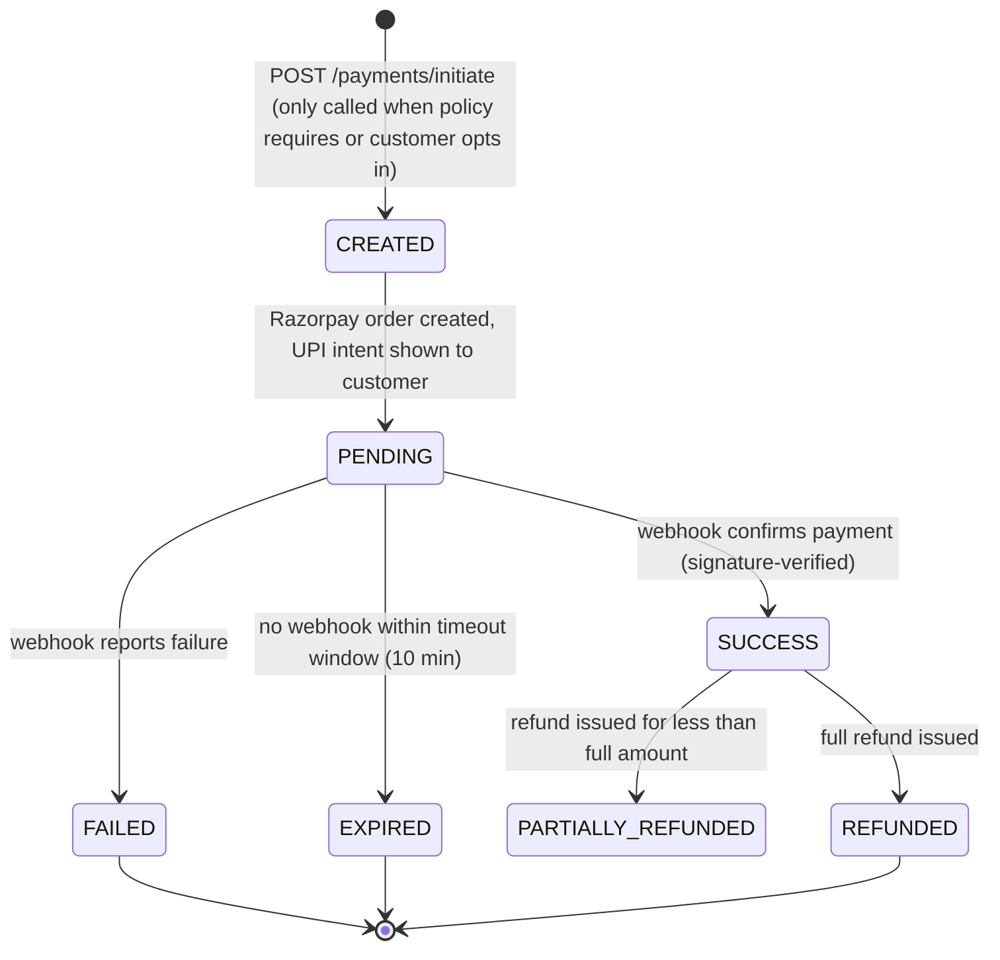

# BarberCue — Payments

Status: **V1 decisions finalized.**

## Provider

**Razorpay, confirmed**, behind a `PaymentGateway` interface (`createOrder`, `verifyWebhookSignature`, `initiateRefund`; reserved for future — not implemented — `createMandate`/`chargeAuthorizedMandate`). Swapping providers later means writing one new adapter class, not touching booking/cancellation business logic, which only ever calls the interface.

V1 online payment method: **UPI only.** Razorpay's Orders/Checkout API is configured to restrict available methods to UPI at checkout time — if Razorpay's flow technically requires the generic Orders API (which supports multiple methods) rather than a UPI-only-specific endpoint, that's an implementation detail of *how UPI is invoked*, not an added payment method; no card/wallet/netbanking flow is built, surfaced, or reachable from the product. Cash may be recorded operationally (a booking/visit marked paid-in-cash for bookkeeping) with no processing logic.

## Prepayment is policy-driven, not mandatory (resolved)

Whether a `Payment` is required at all is determined per salon by `SalonPaymentPolicy.prepaymentRequirement`:

| Policy | Behavior |
|---|---|
| `NONE` (V1 default when unset) | Booking confirms on capacity alone. No `Payment` created unless the customer later chooses to pay ahead voluntarily (e.g. at check-in) or the salon collects in person. |
| `OPTIONAL` | Same as `NONE` for confirmation purposes, but the booking flow *offers* prepayment; if the customer accepts, a normal `Payment` is created against the already-`CONFIRMED` booking. |
| `PARTIAL` | Booking starts `PENDING_PAYMENT`; `prepaymentRequiredAmount = Service.price × prepaymentPercentage`; confirms on webhook success for that amount. |
| `FULL` | Same as `PARTIAL` with `prepaymentRequiredAmount = Service.price`. |

No code path assumes "every booking is prepaid" — the payment-required branch and the no-payment branch are both first-class, not one being a workaround of the other. See [STATE_MACHINES.md](STATE_MACHINES.md#booking).

## Payment state machine

Only the Razorpay webhook moves a payment into `SUCCESS`/`FAILED` — a client-reported "payment done" signal only triggers more aggressive polling, never a state write. Non-negotiable given UPI's confirmation-timing variability.

## Idempotency & webhook handling

- `POST /payments/initiate` requires `Idempotency-Key`; a retried call with the same key returns the existing `Payment`, never a duplicate order.
- The webhook handler verifies Razorpay's signature before any state change, then treats `providerPaymentId` (unique constraint) as the de-duplication key for repeat webhook deliveries — a second delivery is a no-op that still returns `200`.
- Webhook processing and the resulting `Booking`/`QueueEntry` update happen in one DB transaction.

## Refunds

`Refund` rows tie to a `Payment`; total refunded ≤ original amount, enforced before calling Razorpay. Refund status starts `INITIATED`, confirmed via webhook (`refund.processed`), not trusted synchronously.

## Cancellation charge collection (resolved — this was the key open question)

Charge computation (window/amount/percentage, late-cancel vs. no-show) is fully specified in [STATE_MACHINES.md §Cancellation flow](STATE_MACHINES.md#cancellation-flow-resolved). This section covers only *how the money side is handled once a charge amount is known*:

1. **An eligible `Payment` (status `SUCCESS`) exists for the booking**: the charge is realized as a reduced refund — `refundAmount = paidAmount - chargeAmount` (floor 0). One `Refund` row for the net amount. The retained portion is already-collected money; no new charge transaction is created or needed.
2. **No eligible payment exists** (the common case under `NONE`/`OPTIONAL` policy salons, or a `PARTIAL` booking where the charge exceeds what was prepaid): **BarberCue does not attempt to charge the customer.** A `CustomerLedgerEntry(status = OUTSTANDING)` is created instead — amount, reason, salon, and booking reference. No card/UPI/wallet charge is invented or attempted against a customer who never authorized one; that would be fake automatic collection, which is explicitly excluded.
3. The ledger entry is: surfaced to the customer via `GET /customers/me/ledger`; usable by the booking-creation flow to block/warn on new bookings until settled (policy-controlled, default = block at the same salon only); and settleable manually (staff marks paid) today.
4. **Future extension point, not built now**: `PaymentGateway.createMandate` / `chargeAuthorizedMandate` (UPI Autopay or equivalent) would let ledger settlement attempt an automatic charge before falling back to manual collection. The interface shape reserves this; no mandate code exists in V1.

## Who receives the cancellation/no-show charge

Recorded as salon-attributable revenue in `AuditLog`/`Payment`/`CustomerLedgerEntry`. **No payout/settlement system exists in V1** — BarberCue does not move money to a salon's bank account for anything, including retained cancellation charges. That remains a bookkeeping record visible to the owner in the dashboard until a settlement/payout epic is explicitly planned; not guessed at here.

## Resolved (previously open)

- Gateway vendor: Razorpay, confirmed.
- Prepayment mandatory-or-not: resolved as policy-driven (`NONE`/`OPTIONAL`/`PARTIAL`/`FULL`).
- Uncollectable cancellation charge handling: resolved as `CustomerLedgerEntry`, no fake auto-collection, explicit future mandate seam.
- Platform commission: still none in V1 (salons free) — unchanged, not reopened by this round of decisions.
