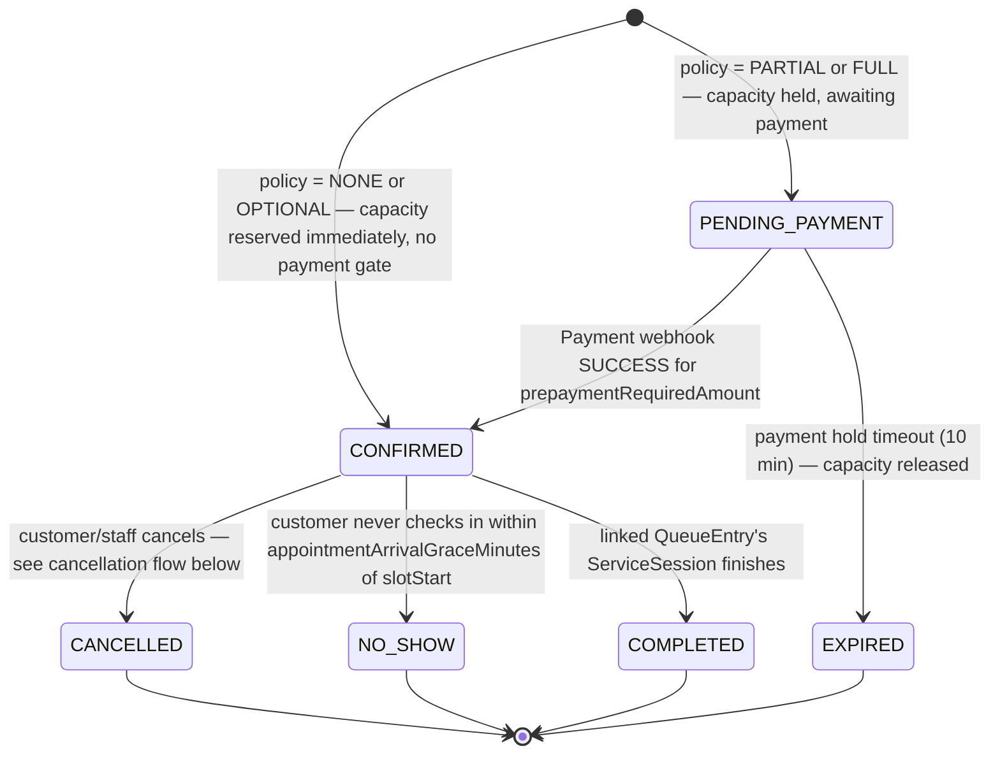
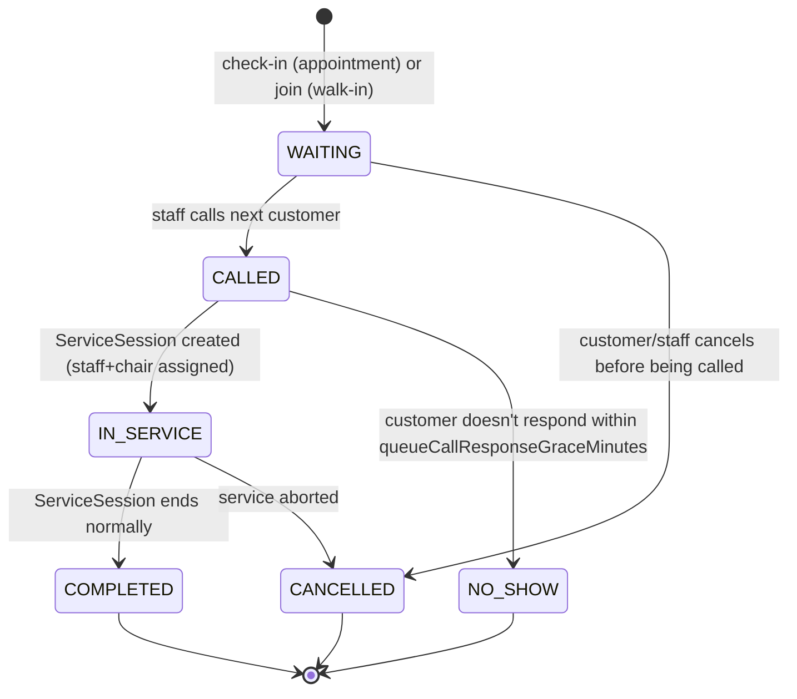
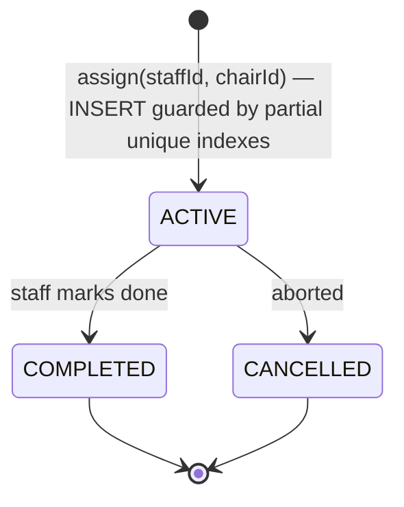
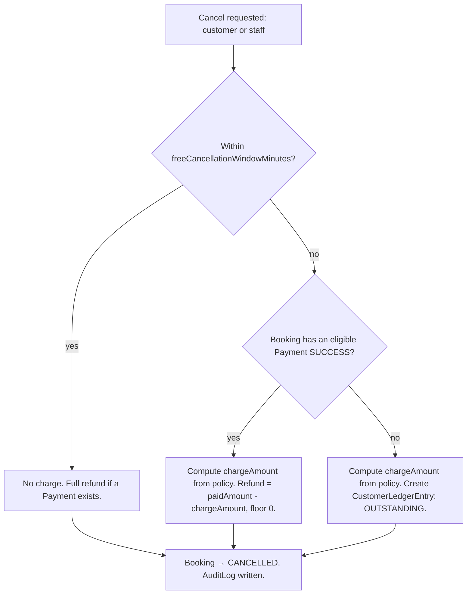
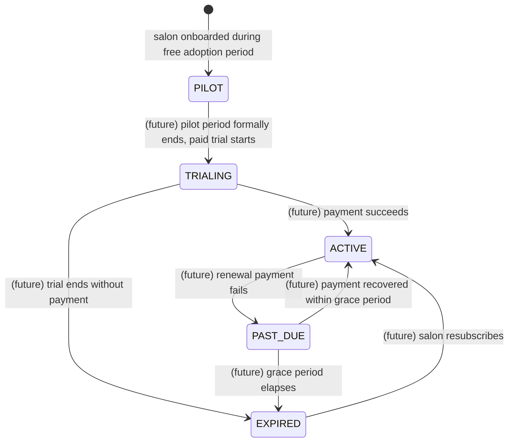

# BarberCue — State Machines

Status: **V1 decisions finalized** — no branch below is hypothetical/pending.

## Booking

A `Booking`'s starting state is a pure function of the salon's `SalonPaymentPolicy.prepaymentRequirement` (default `NONE` if the salon has no policy row — a booking is never silently required to prepay).

Under `OPTIONAL`, a customer may still voluntarily create a `Payment` against an already-`CONFIRMED` booking (e.g. "pay now to skip paying at the counter") — this never re-gates `Booking.status`; the booking was already confirmed by capacity reservation alone. Under `PARTIAL`, `prepaymentRequiredAmount` is `Service.price × prepaymentPercentage`; the remaining balance is collected operationally (cash/in-person or a second payment) and is outside this state machine's concern — this architecture only tracks the *online* prepayment portion.

Race-condition prevention: covered in [DATABASE.md §Booking capacity model](DATABASE.md#booking-capacity-model-resolved--service-level-not-salon-wide) — the capacity check and the `Booking` insert are one transaction.

**Phase 3B implementation status**: `[*] → CONFIRMED` / `[*] → PENDING_PAYMENT` and `CONFIRMED → CANCELLED` are built and live (`POST /bookings`, `POST /bookings/:id/cancel`, see [API.md](API.md)). The `PENDING_PAYMENT` branch is implemented for correctness per the policy function above but not reachable with current data — no salon has a `PARTIAL`/`FULL` `SalonPaymentPolicy` configured yet (payment-policy management is dashboard work). `PENDING_PAYMENT → CONFIRMED`/`EXPIRED` (the Payments webhook/hold-timeout) and `CONFIRMED → NO_SHOW`/`COMPLETED` are not built — Payments and queue check-in are separate, later phases.

## Queue entry creation timing (resolved)

- **Appointments**: `Booking` creation does **not** create a `QueueEntry`. A `QueueEntry` (`source = APPOINTMENT`) is created when the customer checks in on arrival, via a dedicated check-in action (`POST /bookings/:id/check-in`, see [API.md](API.md)). Checking in before `CONFIRMED` (i.e. while still `PENDING_PAYMENT`) is rejected. **Not yet built** — queue check-in is explicitly out of scope through Phase 3B, which implements booking creation/list/detail/cancel only.
- **Walk-ins**: `QueueEntry` (`source = WALK_IN`, `bookingId = null`) is created immediately on `POST /salons/:salonId/queue/join`.
- Both sources converge into the same `QueueEntry`/`ServiceSession` machinery below — the queue engine does not branch on `source` past creation, except that `source` is retained for analytics and for the appointment no-show check (which acts on `Booking`, not `QueueEntry`, since an appointment can go `NO_SHOW` without ever having a `QueueEntry` at all).

## Queue entry

`estimatedWaitMinutes` is recomputed whenever any `QueueEntry` in the salon changes state or any `SalonStaff` status changes — a derived, cached value, never authoritative for ordering (order is `joinedAt`, i.e. check-in/join time, not the ETA number).

## ServiceSession (the concurrency-critical one — unchanged, reconfirmed)

Enforcement is the two partial unique indexes in [DATABASE.md](DATABASE.md#booking--queue) — a barber or chair can never have two `ACTIVE` sessions. A conflicting concurrent assignment returns `409 CHAIR_ALREADY_OCCUPIED` / `409 STAFF_ALREADY_OCCUPIED`; this is an expected, routine response (multiple staff can be operating the dashboard at once), not an error condition to alarm on.

## Payment

See [PAYMENTS.md](PAYMENTS.md#payment-state-machine).

## Cancellation flow (resolved)

No-show follows the same fork at the moment a no-show is detected (system-triggered, see below), using `noShowChargeType`/`noShowChargeValue` instead of the late-cancellation values.

**Phase 3B implements branches B/C/F only** (`POST /bookings/:id/cancel`) — no-show detection (the system-triggered fork) and branch D/E (an eligible `Payment` exists → refund) are not reachable with current data, since no salon has a payment policy configured and the Payments module isn't built yet; implementing the refund branch now would be dead, untestable code, so it's deferred rather than half-built.

**BarberCue never attempts to auto-collect from a customer with no prior payment or stored authorization.** When there's nothing to charge against, the outcome is a `CustomerLedgerEntry(OUTSTANDING)`, not a payment attempt. It is:
- exposed to the customer today via direct API/DB inspection only — the dedicated `GET /customers/me/ledger` read endpoint mentioned below is still unbuilt (out of scope for Phase 3B; verified via Prisma directly in that phase's e2e tests instead),
- available to salon/platform policy as a gate on new bookings (`POST /bookings` checks for `OUTSTANDING` entries and blocks or warns, per a configurable policy flag — default in V1: **block new bookings at the same salon** until settled; cross-salon blocking is a platform-level policy choice, off by default),
- settle-able manually today (staff marks it paid at the counter, or a future feature lets the customer pay it off online) and, in the future, via an authorized-payment/UPI-mandate mechanism.

**Extensibility for a future mandate mechanism**: the `PaymentGateway` interface ([PAYMENTS.md](PAYMENTS.md)) reserves the shape for a future `createMandate`/`chargeAuthorizedMandate` pair (UPI Autopay or equivalent) that, when built, would let `CustomerLedgerEntry` settlement attempt an automatic charge before falling back to manual collection. **Not implemented in V1** — this is an architectural reservation, not a stubbed code path.

## Idempotent, auditable transitions

Every state transition — customer-initiated or system-triggered — is:
- **Idempotent**: driven by an `Idempotency-Key` (customer/staff actions) or a deterministic system key like `noshow:{queueEntryId}:{date}` (the scheduled no-show sweep). A retried job run or a double-tapped button cannot double-transition or double-charge. **Implemented in Phase 3B** (`IdempotencyInterceptor` + the `IdempotencyKey` table defined since Phase 1) for `POST /bookings` and `POST /bookings/:id/cancel` — the first endpoints to actually need it. The no-show sweep's deterministic key remains unimplemented (no-show detection isn't built yet).
- **Auditable**: every transition that has money or customer-facing consequences (cancellation, no-show, ledger creation/settlement) writes an `AuditLog` row, with `actorUserId = null` for system-triggered ones. Cancellation's `AuditLog` write is implemented in Phase 3B.

## Salon subscription (inert in V1)

No transition past `PILOT` is reachable by any V1 code path.

## Resolved (previously open)

- Prepayment is policy-driven per salon (`NONE`/`OPTIONAL`/`PARTIAL`/`FULL`), never hard-coded — resolved above.
- No-show/grace windows are configuration (`CancellationPolicy`), with sensible seeded defaults (10 min arrival, 3 min queue-call response) — resolved in [DATABASE.md](DATABASE.md).
- Queue-entry creation timing (check-in for appointments, immediate for walk-ins) — resolved above.
